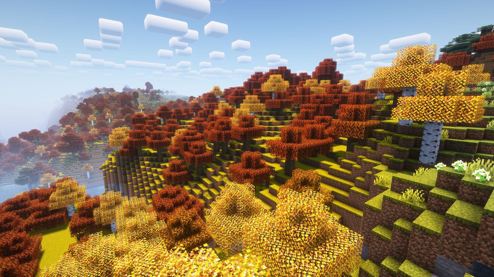
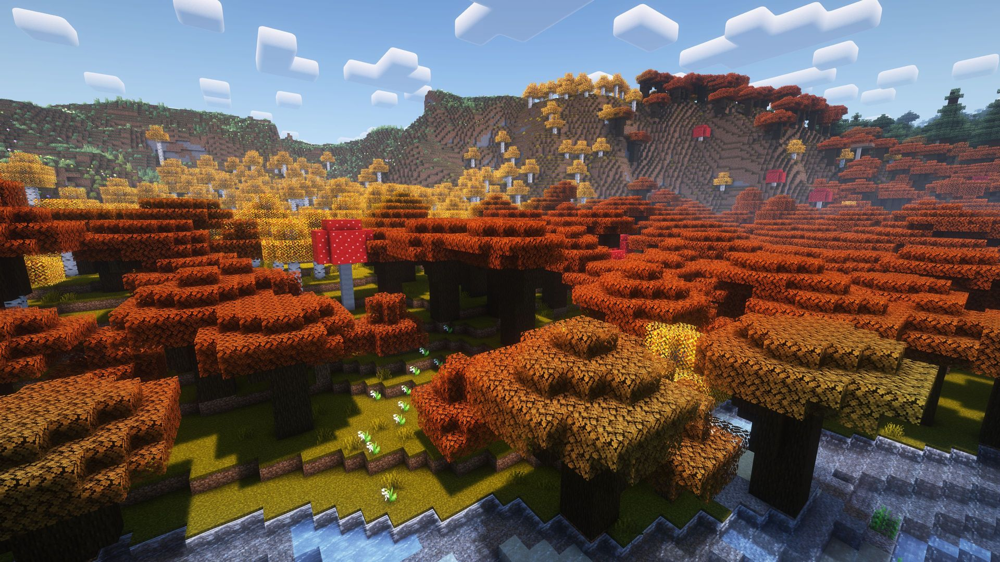

# Autumn Biomes

## English (En)

This resource pack changes the color of grass and foliage to autumn colors. The changes concern five biomes - Birch, Old Growth Birch Forest, Forest, Flower Forest and Dark Forest.

Birch foliage has a new texture everywhere, regardless of the biome.

> The files with "**pa**" in name like `"Autumn-Biomes-1.0pa+1.14-1.14.4"` differs in that the texture of birch foliage corresponds to the old texture from "Programmer Art", which was by default before updates 1.14. You can see the differences [below](#version-difference).

## Русский (Ru)

Данный ресурспак меняет цвет травы и листвы на осенний. Изменения касаются пяти биомов - Березняк, Многолетний березняк, Лес, Цветочный лес и Тёмный лес.

Листва берёзы имеет новую текстуру везде, вне зависимости от биома.

> Файлы с "**pa**" в названии, например `«Autumn-Biomes-1.0pa+1.14-1.14.4»`, отличаются тем, что текстура листвы берёзы соответсвует старой текстуре из «Programmer Art», которая была по умолчанию до обновления 1.14. Посмотреть различия можно [ниже](#version-difference).

## Screenshots

Shaders                               |Regular
:------------------------------------:|:------------------------------------:
|
|
|
|
|
|
|
|
|
|
|
|
|
|

## Version difference

Regular                              |Programmer Art
:-----------------------------------:|:------------------------------------:
|
|
 |
